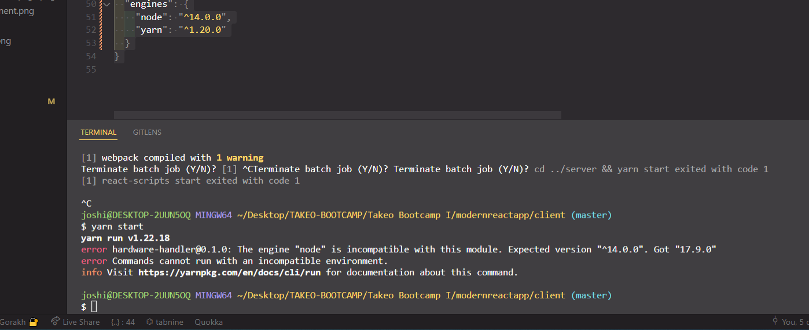
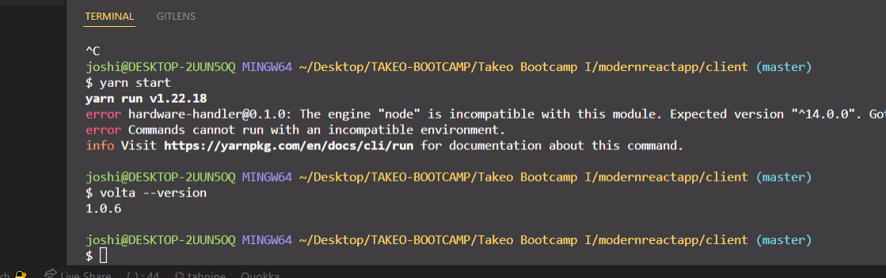

# Lock down the Node.js and Yarn versions

Our last lesson had us upgrading the React app from React v16.4.1 to React v18.0.0 and resolving any errors that arose as a result of the upgrade.

And that's all well and good, but there's more we could do, in fact, more we _should do_ to ensure that when any other developers join our team and develop a new feature, it doesn't break the app right after deployment because they were developing locally on a different version of Node.js than the app is running in the production environment.

So, let's take a couple of steps to prevent such catastrophes from happening. No developer should have to live through that if a little extra upfront work can prevent it.

**In this lesson, we'll learn how to explicitly define our project's environment configurations so that it's harder for devs to do the wrong thing than it is to do the right one.**

### Define the Node engines in the package.json

If you're not familiar with [Node engines](https://docs.npmjs.com/cli/v7/configuring-npm/package-json#engines), it's a rarely discussed but very useful code snippet you can include in a project's `package.json` file to let anyone downloading the code know exactly which versions of Node.js, npm, and Yarn are required for the app to run.

As the npm docs themselves put it: "[ with engines ] you can specify the version of node that your stuff works on". That's it. Plain and simple.

> When `"engines"` aren't included (or you use a wildcard `"*"`) in a `package.json`, node assumes any version of it will work.

So with that in mind, let's define our Node and Yarn versions for our app.

Open up our `client/` folder's `package.json` file, and at the very end, right after `"license" : "ISC"`, add the following lines:

```jsx
  "description": "This project was bootstrapped with [Create React App](https://github.com/facebook/create-react-app).",
  "main": "index.js",
  "devDependencies": {},
  "author": "",
  "license": "ISC",
  "engines": {
    "node": "^14.0.0",
    "yarn": "^1.20.0"
  }
}
```

Now, when a developer attempts to install the dependencies and run this app on a Node.js version other than the defined one, an error will be thrown in the console.

Here's an example screenshot where I set the `"engines"` Node version to `"14.0.0"`, but my local development environment is running Node.js version v17.9.0.



See the warning in this error message screenshot? `The engine "node" is incompatible with this module. Expected version "^14.0.0". Got "17.9.0"` That _should_ deter most developers from attempting to go much further with an incompatible Node version.

There is one catch, though. Including `"engines"` alone in the `package.json` doesn't guarantee a developer _must_ use the specified versions as defined.

And if you're a dev lacking the recommended version of Node or npm or what-have-you but you're excited to start developing that shiny new feature, you might be tempted to ignore the warnings provided by `"engines"` in the command line and forge ahead.

For that reason, we're going to make it even easier for any dev to do the right thing, so easy, in fact, you'll wonder how you ever developed without this little addition to your tooling setup: Volta.

### Volta: Taking the hassle out of JavaScript command-line tools

[Volta](https://volta.sh/) is an awesome tool designed to make managing our JavaScript command-line tools, such as `node`, `npm`, `yarn`, or executables shipped as part of JavaScript packages, really easy.

Similar to package managers, Volta keeps track of which project (if any) you’re working on based on your current directory. The tools in your Volta toolchain automatically detect when you’re in a project that’s using a particular version of the tools and takes care of routing to the right version of the tools for you.

It's very cool in practice. Up to now, I'd been using [NVM](https://github.com/nvm-sh/nvm) to manage and switch between different versions of Node.js depending on which project I'm working in, but it was more complicated to set up initially _and_, more importantly, Volta takes the thinking part out of the equation. When it's set up in a project and installed on a local machine, I don't even have to think about switching versions; Volta just does it for me.

#### Download Volta locally

So to get started, let's download Volta locally.

**Volta installation on MacOS/Linux systems**

Open up a new terminal window and run the following command:

```shell
curl https://get.volta.sh | bash
```

**Volta installation on Windows systems**

Download and run the [Windows installer](https://github.com/volta-cli/volta/releases/download/v1.0.4/volta-1.0.4-windows-x86_64.msi) and follow the instructions.

> **Note for Windows users**
>
> Volta's functionality depends on creating symlinks, so you must either:
>
> - Enable [Developer Mode](https://docs.microsoft.com/en-us/windows/uwp/get-started/enable-your-device-for-development#accessing-settings-for-developers) (recommended)
>   > - Run Volta with elevated privileges (not recommended)

**Check Volta installation succeeded**

To ensure Volta's installed afterward, open another new terminal window and type:

```shell
volta -v
```

You should see a result like this if everything installed correctly. If not, try quitting your terminal completely, reopening it, and running the `volta -v` command again.



#### Install Node v14 with Volta

Once you see the Volta version locally on your machine, you're ready to set up a specific version of Volta in our project.

Inside the same `client/` folder where we've been running all our commands, let's run the command:

```shell
volta pin node@14.0.0
```

Even if you don't have this particular Node.js version downloaded locally, by running this command, Volta will not only go out and fetch that version, but it will also _automatically_ add it to the `package.json` file right under the `"engines"` info we just added at the end of the file.

If you check your `package.json` now, the bottom of the file should look something like this:

```jsx
  "main": "index.js",
  "devDependencies": {},
  "author": "",
  "license": "ISC",
  "engines": {
    "node": "^14.0.0",
    "yarn": "^1.20.0"
  },
  "volta": {
    "node": "14.0.0"
  }
}
```

And if you check your terminal's local version of Node with `node -v` in the command line, it should say `14.0.0`.


Something that sets up my correct Node and npm versions, and I don't have to even think about it? Sign me up!

#### Install Yarn v1 with Volta

But wait, there's more! We're not just going to specify our Node version and stop there — we're also going to specify our Yarn version for this project, too.

> There are some pretty significant breaking changes between Yarn v1 and Yarn v2, so clearly defining something like this to prevent issues is definitely a good move.
>
> Yarn has kindly written a [migration guide](https://yarnpkg.com/getting-started/migration) if you'd like to learn more about the differences between the two versions.

Pinning a particular version of Yarn to a project is just as easy as adding Node with Volta.

Once more, in the command line inside of your `client/` folder, type the following command.

```shell
volta pin yarn
```

Afterward, if you check the `package.json`, you should see that Yarn's been added as a dependency to the `"volta"` section.

```jsx
  "engines": {
    "node": "^14.0.0",
    "yarn": "^1.20.0"
  },
  "volta": {
    "node": "14.0.0",
    "yarn": "1.22.18"
  }
}
```

Here's a screenshot of the command line when I pinned the Yarn version to the project, and it immediately switched my project's Yarn version to match the one defined by Volta. For reference, my global Yarn version previously was 1.20.0.


And that's just the tip of the iceberg of Volta's capabilities. If you're interested to see what else it can do, I'd encourage you to check out the rest of [Volta's documentation](https://docs.volta.sh/guide/). It's thorough.

We've really done some good in this lesson. Not only have we defined recommended Node and Yarn versions for any developer who joins the project now, but we've also made it _harder_ to start doing local development on the wrong versions of Node and Yarn, thanks to Volta.

This sort of low-level project configuration, although it only took a few extra minutes and lines of code now, is going to make a world of difference to a development team in the future. If we can prevent even one failed deployment due to something as mundane as incompatible Node versions in development versus production, it will be worth it.

---
