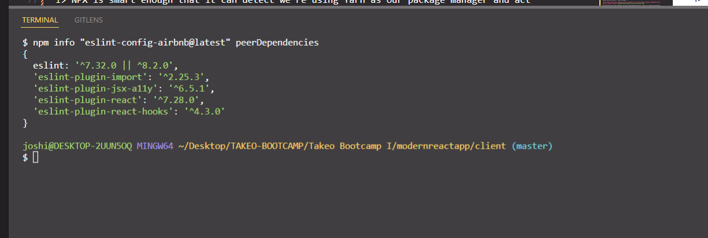
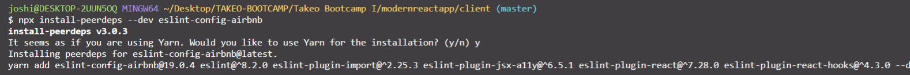
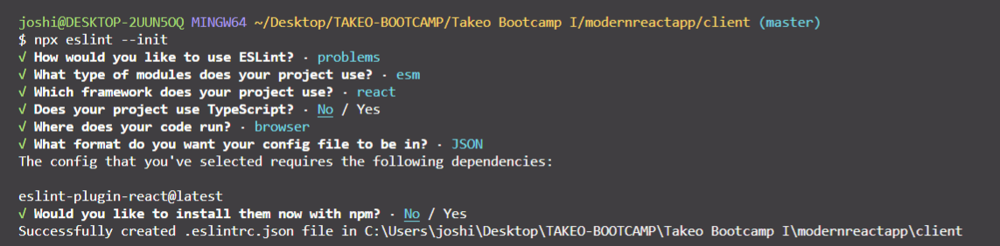
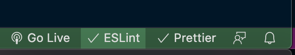
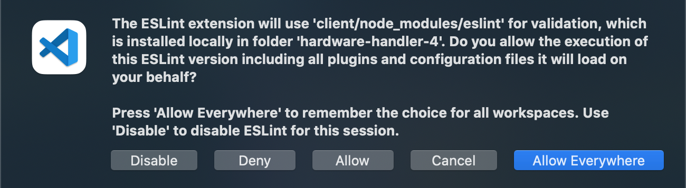
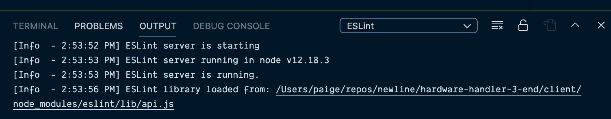
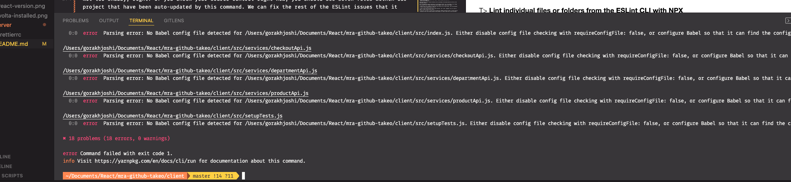
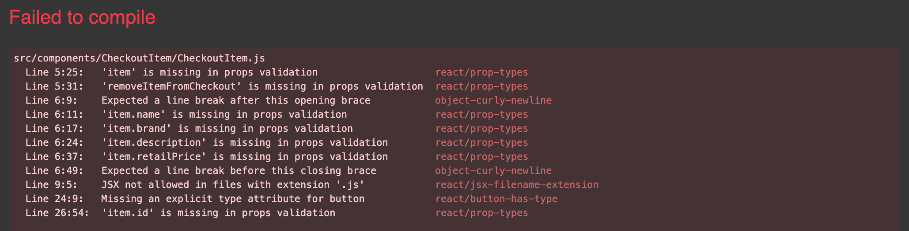

# What's the point of a linter?

One of the things developers love and hate most about JavaScript is the fact that it is a dynamic, loosely-typed language. You want to turn that string into an integer? No problem. This object needs to be an array? It can do that, too.

But because JavaScript is so flexible (and lacks a compilation process), it is also especially prone to developer errors, and we typically find those errors only through code execution. And that's where [linters](<https://en.wikipedia.org/wiki/Lint_(software)>) come in.

Linters statically analyze your code to quickly find problems. They can suggest fixes or even fix code automatically sometimes, and linting tools like ESLint allow developers to discover problems with their JavaScript code without executing it.

The bottom line is: linters help make us better developers by alerting us to anti-patterns and bugs _before_ we run our code. And ESLint is the best linter available today.

**In this lesson, we'll learn how to add it to our project and set it up to run all the time in our code editor during development.**

> Fun fact: Create React Apps already comes with some more generic ESLint configurations set under the hood, but we're going to take it up a notch and learn how to configure it to our specific project needs.

### What is ESLint?

[ESLint](https://eslint.org/) is the currently preferred linter for JavaScript projects of all sorts. It's been around since 2013, and its primary reason for being is to allow developers to create their own preferred set of linting rules.

ESLint is designed so that all the rules work independently of each other, and they can be added and removed or turned on and off at will. It's very plug-and-play. Each project use case is unique in some ways, and ESLint knows and embraces this, making itself easy to configure to meet the needs of the project.

In addition to being highly configurable, allowing you to add any and all the rules you desire (of which [there are many](https://eslint.org/docs/rules/)), ESLint also integrates very well with lots of code editors, VSCode included. Put a pin in that statement for later in the lesson.

#### Airbnb: The ESLint config of choice for React

Some might argue that ESLint is _so_ unopinionated that it's not very useful starting from scratch. And I'm inclined to agree; there's a lot of rules to look through and decide which ones are the standards your team wants to adhere to.

A fairly common practice that's sprung up today is that projects will use an already-defined ESLint config as a starting point and then make tweaks to the originally defined set of rules laid out to suit the team's needs and style of development.

One such config that's gained a large and loyal following, especially amongst React development teams, is the [ESLint config set forth by the Airbnb team](https://airbnb.io/javascript/react/).

It's a robust style guide based on standards that are currently prevalent in JavaScript, and as the team docs themselves put it, the config serves as a "mostly reasonable approach to React and JSX".

Each rule is clearly laid out in the [documentation](https://airbnb.io/javascript/react/) with code examples, and some even have extra explanations, depending on the rule. I highly recommend giving it a read; a lot of the rules indirectly spell out React best practices that any codebase can benefit from. But that's enough talk about Airbnb's ESLint config. Let's start adding it to our project.

### Remove any pre-existing ESLint config files your project may have

It's worth pointing out that if you're developing on an already existing React app, it may already have an ESLint file in it. This file could be something like `.eslintrc.yaml`, `.eslintrc.json`, `.eslintrc.js`. (These are all valid ESLint configs — it's flexible in what it will accept like Prettier.)

I would strongly recommend you delete it completely and start fresh. ESLint's made many improvements since that file was probably set up, and rules that may previously have been needed are now default, configs that existed may have been renamed, etc. Instead of trying to merge the existing ESLint file with the new one I detail below, I'd start over.

> Besides, if you realize there are some rules you can't live without, your version control system will remember the old config file, and you can grab whatever you need from it.

### Download all the required ESLint npm packages

Unlike setting up Prettier, in our previous lesson, which required just one new npm package, ESLint requires _a bunch_.

If you read the [ESLint npm documentation](https://www.npmjs.com/package/eslint-config-airbnb), it outlines all the peer dependencies (peer deps) that the Airbnb ESLint depends on, but instead of just installing whatever the latest version is of each peer dep, it provides a quick shell script to identify the correct version for each additional dependency for the current version of the Airbnb ESLint library.

So, open up the code in your IDE and `cd` into the `client/` folder from the terminal, and run the following commands:

```shell
npm info "eslint-config-airbnb@latest" peerDependencies
```

Once you run this, you should see all the required peer deps for whatever version of the `eslint-config-airbnb` npm package. It will look something like this in your terminal.



Now, if you have a version of npm installed that's `npm` v5 or above, there's a little shortcut you can take to install all these dependencies so that you don't have to do them one by one.

After checking your `npm` version in the terminal with `npm -v` and confirming it's over version 5 (mine is currently 8.5.5), paste this command into the terminal:

```shell
npx install-peerdeps --dev eslint-config-airbnb
```

> Why yes, that command says `npx`, and yes, we're using `yarn` in our project as our package manager.
>
> NPX is smart enough that it can detect we're using Yarn as our package manager and act accordingly.
>
> If you're not as familiar, `npx` is a tool intended to help round out the experience of using packages from the npm registry — the same way npm makes it super easy to install and manage dependencies hosted on the registry, NPX makes it easy to use CLI tools and other executables hosted on the registry.
>
> Basically, `npx` makes it possible to install `devDependencies` to projects locally without having to install them globally.
>
> It's also great if you just want to try a CLI tool once without having to install it globally. Just use `npx <command>` when `<command>` isn’t already in your $PATH, and `npx` will automatically install a package with that name from the npm registry for you and invoke it.
>
> If you'd like to learn more about `npx`, this [article is full of useful info](https://blog.npmjs.org/post/162869356040/introducing-npx-an-npm-package-runner.html#:~:text=npx%20is%20a%20tool%20intended,executables%20hosted%20on%20the%20registry.).

If the install was successful, you should see the following sort of output in the terminal afterward.



But we're not quite done yet. We've got a few more dependencies we need to install for ESLint to work properly with this Create React App application.

Here are the other dependencies you need to install. These are so Prettier and the latest version of Create React App will play nice with all of our ESLint rules. I'll elaborate on this in the troubleshooting section at the end.

```shell
yarn add --dev @babel/eslint-parser @babel/preset-react eslint-config-prettier
```

Then if you check your `package.json` in your `client/` folder, you should see the following new dev dependencies.

**package.json**

```json
 "devDependencies": {
    "@babel/runtime": "^7.17.9",
    "@babel/eslint-parser": "^7.17.0",
    "@babel/preset-react": "^7.16.7",
    "eslint": "^8.2.0",
    "eslint-config-airbnb": "19.0.4",
    "eslint-config-prettier": "^8.5.0",
    "eslint-plugin-import": "^2.25.3",
    "eslint-plugin-jsx-a11y": "^6.5.1",
    "eslint-plugin-react": "^7.28.0",
    "eslint-plugin-react-hooks": "^4.3.0"
  }
```

With all of our ESLint dependencies installed, it's time to add the `.eslintrc.json` file to our project.

> You might be wondering what the difference is between `"devDependencies"` and plain `"dependencies"` inside a `package.json`, and the main difference is _where_ the dependencies are required.
>
> If your app needs a dependency (like `"react"`) to run in production, `"react"` should be included in the `"dependencies"` array.
>
> If an app needs a dependency only during local development and testing (like `"eslint"` to check your code), it can be included in the `"devDependencies"` array.
>
> Furthermore, any packages listed in the `"devDependencies"` array won't be bundled into your final `dist/` folder at build time when the project goes into production. While it may seem like a few extra npm packages won't affect your bundle size much, anywhere we can save some space and make load times quicker results in a better user experience.
>
> The [npm Docs](https://docs.npmjs.com/specifying-dependencies-and-devdependencies-in-a-package-json-file) do a good job of further clarifying how to add and modify packages in a project if you'd like to learn more.

#### Create a .eslintrc.json file

We're going to use NPX to help create the new `.eslintrc.json` file in our project. To do so, run the following command in the command line inside your `client/` folder:

```shell
npx eslint --init
```

Follow the question prompts in the command line, answering each one similar to how I answered mine in the screenshot below, and eventually, a new `.eslintrc.json` file should be created in the root of your `client/` folder.



Upon initialization, the `.eslintrc.json` file should look something like this:

**.eslintrc.json at time of creation**

```json
{
  "env": {
    "browser": true,
    "es2021": true
  },
  "extends": ["eslint:recommended", "plugin:react/recommended"],
  "parserOptions": {
    "ecmaFeatures": {
      "jsx": true
    },
    "ecmaVersion": 13,
    "sourceType": "module"
  },
  "plugins": ["react"],
  "rules": {}
}
```

This is a good starting place, but since we're incorporating Prettier and Airbnb's ESLint configs into the project, we've got some things to add to this file.

First, I'll show you the final version of the `.eslintrc.json` file I ended up with when I added all my preferred initial rules, extensions, and plugins.

Then, if you want to learn more about the various pieces that go into an ESLint file, you can read the descriptions. Prefer to just move on to downloading the ESLint VSCode extension? No problem, copy this file into your own local `.eslintrc.json` file, and skip ahead to the next section.

**.eslintrc.json with extensions, plugins, and starter rules added**

```json
{
  "root": true,
  "env": {
    "browser": true,
    "es2021": true,
    "node": true,
    "jest": true
  },
  "extends": [
    "eslint:recommended",
    "plugin:react/recommended",
    "airbnb",
    "airbnb/hooks",
    "prettier"
  ],
  "parser": "@babel/eslint-parser",
  "parserOptions": {
    "ecmaFeatures": {
      "jsx": true
    },
    "ecmaVersion": 12,
    "sourceType": "module"
  },
  "plugins": ["react", "react-hooks"],
  "rules": {
    "import/prefer-default-export": 0,
    "no-console": [
      "error",
      {
        "allow": ["error"]
      }
    ],
    "no-const-assign": "warn",
    "no-extra-semi": "error",
    "no-undef": "warn",
    "no-unreachable": "warn",
    "no-unsafe-finally": "warn",
    "no-unused-vars": "warn",
    "no-unused-expressions": [
      "error",
      {
        "allowShortCircuit": false,
        "allowTernary": true
      }
    ],
    "react/no-array-index-key": "warn",
    "prefer-const": "warn",
    "react/jsx-filename-extension": [1, { "extensions": [".js", ".jsx"] }],
    "react-hooks/rules-of-hooks": "error",
    "react-hooks/exhaustive-deps": "warn",
    "react/prop-types": 1,
    "react/no-unused-state": "warn",
    "react/react-in-jsx-scope": 0,
    "semi": ["error", "always"]
  }
}
```

If you're reading this part, I'm assuming you'd like to learn more about how ESLint works, which is a good thing. Even though it will still work just fine if you copy/paste this into your local project, a better understanding of ESLint can only benefit you in the future.

We'll start at the top of this file and work down, section by section.

#### "root": true

By default, ESLint will look for [configuration files](https://eslint.org/docs/user-guide/configuring/configuration-files#cascading-and-hierarchy) in all folders of a project up to the root directory. While this can be useful if you want all of your projects to follow a certain convention, it can sometimes lead to unexpected results.

To limit ESLint to a specific project, place `"root" : true` inside the `.eslintrc.json` file, and as soon as ESLint finds a config file containing this line, it will stop looking in further parent directories beyond the current one.

#### "env": "browser": true

Specifying environments provides predefined global variables, and they're not mutually exclusive, so you can specify multiple environments within one config file without issue.

The ones we're including in our project should be fairly self-explanatory (`browser`, `jest`, `es2021` syntax), but if you'd like to see the other options (there are many), check out the [documentation on language options](https://eslint.org/docs/user-guide/configuring/language-options).

#### "extends": "eslint/recommended", "prettier", "airbnb", etc.

A config file, once extended, can inherit all the traits of another configuration file (including rules, plugins, and language options).

If you look at our `"extends"` property, the first two extensions `"eslint:recommended", "plugin:react/recommended"` are automatically included based on how we answered the questions when we created the `.eslintrc.json` file.

The last three extensions: `"airbnb", "airbnb/hooks", "prettier"` are from the Airbnb and Prettier peer dependencies we installed in the project manually.

The [eslint-config-prettier](https://github.com/prettier/eslint-config-prettier) in particular is brought in because otherwise, some of ESLint's default code formatting rules will conflict with Prettier's code formatting. This turns off the rules in ESLint that would conflict.

> When using the `"extends" : []` config, the `eslint-config-` prefix can be omitted from the configuration name. For example, `"airbnb"` inside the `"extends"`, resolves as `eslint-config-airbnb`.

#### "plugins": "react", "react-hooks"

A plugin is an npm package that can add various extensions to ESLint. A plugin can perform numerous functions, including but not limited to adding new rules and exporting shareable configurations. Just make sure the package has been installed in a directory where ESLint can require it.

> This is one reason our `.eslintrc.json` file lives within our `client/` folder instead of being able to live at the root of our whole app — because it accesses the plugins `"react"` and `"react-hooks"`, which are installed in the `node_modules` folder at this level.

And just like with the `"extends"` property, the `"plugins"` property value can omit the `eslint-plugin-` prefix of the package name too.

> You might wonder why we're not specifically importing two of the Airbnb peer dependencies in the `"plugins"` section of the `.eslintrc.json` file. The answer is: we don't need to.
> I>
> I> By extending the `"airbnb"` and `"airbnb/hooks"` configurations in the file above, the `"eslint-plugin-import"` and `"eslint-plugin-jsx-a11y"` are implicitly included, and there's no need to include them explicitly.

#### "parser": "@babel/preset-react"

By default, ESLint uses [Espree](https://github.com/eslint/espree) as its parser.

ESLint's default parser and core rules, however, only support the latest final ECMAScript standard and do not support experimental (such as new features) and non-standard (such as Flow or TypeScript types) syntax provided by Babel. Therefore, we use the `@babel/eslint-parser`: a parser that allows ESLint to run on source code that is transformed by Babel.

#### "parser-options": "parser options"

ESLint allows you to [specify the JavaScript language options](https://eslint.org/docs/6.0.0/user-guide/configuring#specifying-parser-options) you want to support in your project. By default, ESLint expects ECMAScript 5 syntax. When we answered the questions as the `.eslintrc.json` file was created, ESLint overrode that setting to enable support for other ECMAScript versions as well as JSX by using parser options.

As we have a React project, the `"jsx": true` was added to the `"ecmaFeatures"` specification, in addition to `"ecmaVersion" : 12` (support for the latest version of JavaScript) and the `"sourceType": "module"` (since our code is in ES modules).

#### "rules": lots of rules

Ah, `"rules"`, so many rules for ESLint. But thanks to the extensions and plugins we've added, a lot of the rules we want are already included for us without our having to define them. The rules are what give ESLint its power and make it useful to us.

I'm not going to go through each rule listed above one by one. But these are ones that I like to change the default configuration for because I don't think they make sense for the projects I work on.

If you'd like to see exactly what any of the specific rules do, just Google "eslint react/no-unused-state", and you should get the ESLint rule with definitions and code examples of it. It's very helpful.

> Curious what automatically enabled rules from the extensions we added like `"eslint:recommended"`? It's [documented here](https://www.npmjs.com/package/eslint-plugin-react#list-of-supported-rules) (all the rules with checkmarks next to them are automatically turned on).

And with that, we've covered all the most important parts of the existing `.eslintrc.json` file.

It's time to move on to configuring ESLint so that we can identify and fix those errors.

> If there's anything else you wanted to know about ESLint that I didn't cover, I encourage you to check out the [documentation for ESLint](https://eslint.org/docs/user-guide/getting-started) — it's well written.

### Download the ESLint VSCode extension and check it works

Just like in the previous Prettier lesson, if VSCode is your IDE of choice, we're going to make using ESLint even more convenient by setting it up to lint files while we're working on them.

In the VSCode Extensions Marketplace, simply search for "eslint", and the very first result, the one authored by Dirk Baeumer, is the [ESLint plugin](https://marketplace.visualstudio.com/items?itemName=dbaeumer.vscode-eslint) you want.

Check out my screenshot of the extension inside VSCode to make sure you're getting the right one.


Install the plugin, restart your instance of VSCode for it to take effect, then open up another file within our project to check it's working. Let's take a look at the `formatFilters` function. The file name is `formatFilters.js`, and it's located inside the `client/src/helpers/` folder.

#### Enable ESLint in the VSCode bottom toolbar

To turn ESLint on for this project in VSCode, look down at the bottom right of the VSCode editor, and you should see a little ESLint link.



Click it, and a terminal should open up showing you the ESLint config is in effect for the project, and the ESLint link in the bottom of the IDE should have a little checkmark next to it.

> The first time you enable ESLint in a new VSCode project, you may see this modal pop up, asking if you'd like to allow ESLint to lint the project. Hit the "Allow" button to let ESLint do its job.



Check the "ESLint" tab in the terminal from the dropdown to confirm ESLint has started up in VSCode.



### Configure ESLint to automatically lint all project files

Regardless of if you're using the VSCode plugin to lint files you're actively working on, we need to be able to see the linting errors in _all_ our files and have ESLint fix them for us when possible.

We'll do this by adding two new scripts in our `client/` folder's `package.json` file.

Open your `package.json`, and add the following two lines of code at the end of the already existing "scripts" section after the `"eject"` script: `"lint": "eslint src/", "lint:fix": "eslint src/ --fix"`.

**package.json**

```json
"scripts": {
    "start": "concurrently \"cd ../server && yarn start\" \"react-scripts start\"",
    "build": "react-scripts build",
    "test": "react-scripts test",
    "eject": "react-scripts eject",
    "lint": "eslint src/",
    "lint:fix": "eslint src/ --fix"
  },
```

These scripts are one way to check our project for ESLint issues and even resolve some of them.

#### "lint" : "eslint src/"

The first script, which we'd access by running `yarn lint`, will identify all the ESLint errors in the project and list them out line by line in the terminal.

After all the errors have been identified, you'll see a summary print out like the following.

Notice the line underneath the initial summary. It says, "xx errors and xx warnings potentially fixable with the `--fix` option."

This is where our second new script comes into play.

> **Lint the whole project with one command**
>
> This script could also be adjusted lint both pieces of the project, the `client/` and the `server/` folder by changing it to read `"lint": "eslint src/ && eslint ../server"`.
>
> In this case, it's unnecessary because our `server/` folder contains next to nothing, but if it were a full-blown Express/Node.js backend to proxy all our API calls through, it, too, could be linted with one command.

#### "lint:fix" : "eslint src/ --fix"

The second script is a cool one. Every time `yarn lint:fix` runs, any linting issues ESLint identifies that it can fix itself, it will.

Running this command in the terminal will result in ESLint printing out all the problems it couldn't fix, in addition to a summary at the end showing the new count of issues still outstanding.



Not too shabby, right? If you check your source control right now, you should see seven files within our project that have been auto-updated by this command. We can fix the rest of the ESLint issues that it couldn't resolve in our future lessons as we refactor the app.

> **Lint individual files or folders from the ESLint CLI with NPX**
>
> If you wanted to, you could run either of these commands from the command line on the whole project or a single file like so: `npx eslint src/<FOLDER_NAME>/<FILE_NAME>` or `npx eslint src/<FOLDER_NAME>/<FILE_NAME> --fix`.

And that's that. ESLint is now fully integrated into our project, ready to help us make our code better whenever it can.

#### Starting the app up after adding ESLint

The other common error you might encounter after adding ESLint is that the app won't start. Try starting the app back up with `yarn start` in the `client/` folder in the terminal.

Everything seems fine at first, but when the browser opens, you see this and feel like panicking.



This was alarming to me until I found this [thread on StackOverflow with a solution](https://stackoverflow.com/questions/64518226/my-create-react-app-is-failing-to-compile-due-to-eslint-error) to the problem (the first answer is the one you want to read).

For some reason, after the `react-scripts` for Create React App were updated to v4.0.0, some breaking changes happened to the project linting. It seems any ESLint errors present in the project are not converted to warnings by default; instead, they stay as browser errors and cause the app to crash.

The solution? A local `.env` file setting.

#### Create a .env file

Create a `.env` file in the root of the `client/` folder, and add this line to it: `ESLINT_NO_DEV_ERRORS=true`

With this flag, you will receive the ESLint errors as warnings in the console and not as errors in the development browser.

Now, try stopping the app and restarting it in the terminal with the `.env` file present. If all things go according to plan, the app's home screen should reappear, and all should be well again.

I hope that this error scenario is fixed with a new version of the `react-scripts`, but if you encounter it, this is how you might be able to fix it.

> This is one of the few times we don't need to add the `.env` to the `.gitignore` file. It's safe to commit to GitHub through version control.
>
> Since this file doesn't include secrets like API keys, database connection strings, or other sensitive information we don't want anyone outside the team knowing, it's okay to check this in with the project code.
---
