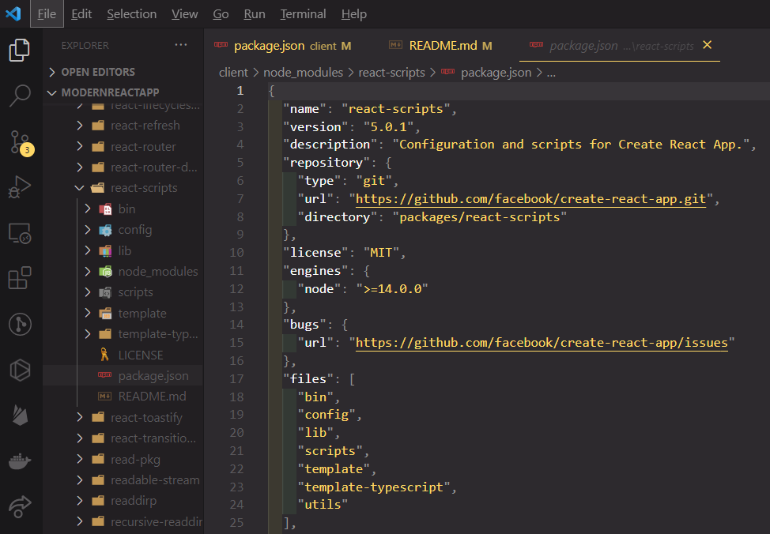
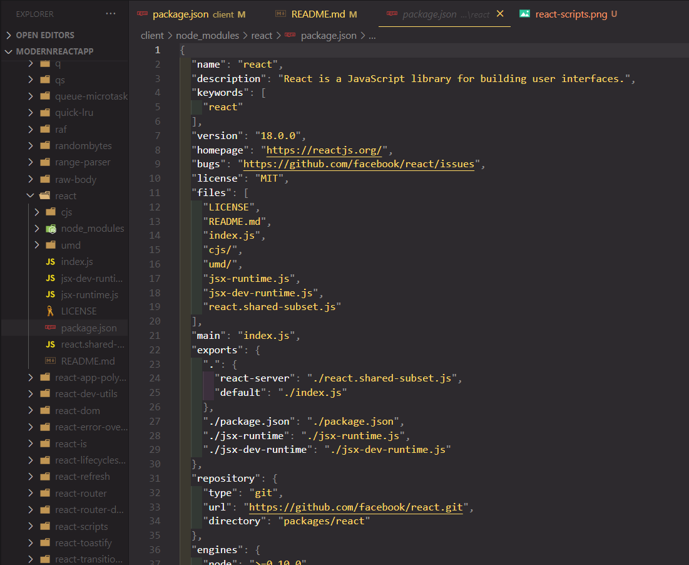
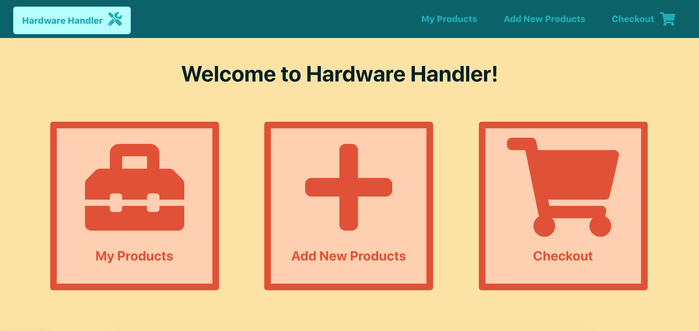

# Upgrade the React app version

Hooks weren't introduced until React v16.8.0, but our app is currently running v16.4.0. The first thing we have to do is upgrade the version of React our application is running.

**This lesson will walk through upgrading our app to use the latest version of React released to date.**

> If you were to attempt to add a hook to our app as it currently exists, you'd see an error in the browser's developer tools along the lines of:
>
> ```javascript
> Uncaught TypeError: Object(...) is not a function
> ```
>
> It's not a very helpful error message, but after a quick [Google search](https://stackoverflow.com/questions/53861645/react-hooks-issues-in-react-16-7-typeerror-object-is-not-a-function), you'll figure out a React version that doesn't work with hooks is the actual issue.

### Create React app docs

Since we have an already existing Create React App, our path to upgrading is a little different than if we were starting from scratch with the most up-to-date version of React. Lucky for us, the [official Create React App docs](https://create-react-app.dev/docs/updating-to-new-releases/) have a fairly well-documented upgrade process.

#### Check the CRA changelog for the latest react-scripts version

**Step one:** Go to the [changelogs for the React Scripts](https://github.com/facebook/create-react-app/blob/master/CHANGELOG.md), and find the newest version of the react-scripts available.

> At the time of writing this, the React Scripts are up to v5.0.1. They may be higher when you start — best to check the Create React App website.

If you scroll down past the initial notes of what new updates this version contains, you should see a section titled "Migrating from X.X.X to X.X.X".

Here are the npm and yarn commands we'll need to upgrade the `react-scripts`, which can then be used to update the React versions in our project.

Copy the yarn command (or npm, if that's your preference): `yarn add --exact react-scripts@5.0.1`, and paste it into your terminal while inside the `client/` folder of your application.

```shell
yarn add --exact react-scripts@5.0.1
```

#### Upgrade all of your React dependencies manually

I'm not sure if it's just the fact that our version of Create React App is so outdated (it was running `react-scripts: 1.1.4`, after all), or if it is something to do with my computer, in particular, but after upgrading the `react-scripts` dependency, deleting my `node-modules` in the `client/` folder, and re-running `yarn`, the React and React DOM versions in my `package.json` did not upgrade on their own.

Not to worry though, we can do it ourselves.

**Step two:** Manually update your `package.json`'s `"dependencies"` section to the new versions of `react` and `react-dom`, and paste in the unit testing libraries you'll need.

> Normally, in a new CRA project starting from scratch, these testing dependencies are included from the start. So we're including them, too, because they are the best options currently out there for automated testing of React apps.

Here are the additional dependencies we need to add or modify for our `package.json`.

```json
    "@testing-library/jest-dom": "^5.16.4",
    "@testing-library/react": "^13.1.1",
    "@testing-library/user-event": "^13.5.0",
```

```json
    "react": "18.0.0",
    "react-dom": "18.0.0",
    "react-router-dom": "^5.2.0",
    "react-scripts": "5.0.1",
```

Notice that the `@testing-library` packages are all new, and you can manually update the existing `react` and `react-dom` versions to `^18.0.0`. Then, delete your `node_modules` folder once more from the `client/` folder, and run `yarn` one more time.

> **A way to get all the correct package dependencies to go with the new react-scripts version**
>
> Unfortunately, there's no easy way to see what React versions go along with which versions of the `react-scripts`, but I found a workaround, made a little easier by the fact we were upgrading to the latest version of React. It's hacky, but it works.
>
> The solution? Make a sample project using the terminal command to spin up a new starter project.
>
> ```shell
> npx install create-react-app sample-app
> ```
>
> Once the sample app's finished installing, you can open up the `package.json` file and see the versions of the `react-scripts`, the corresponding `react` and `react-dom` packages, and any other new upgrades (like the `@testing-library` packages for testing).
>
> Then, just make our project's dependencies match the one in the starter project's `package.json`.

#### Double check the new React versions in the node_modules folder

Before we try to restart the app, it's worth doing a quick spot-check that the updated versions of React and the other new dependencies we added took effect.

**Step three:** Confirm the updated dependencies by opening up the freshly installed `node_modules` folder and checking a couple of key libraries that should have been updated.

**Check React Scripts are v5**

The first dependency I want to ensure has been successfully upgraded are the `react-scripts`. If you open the `node_modules` inside the `client/` folder, scroll down forever to the `react-scripts` and check the `package.json` file.

If everything went as expected, you'll see the the version of this package is 5.0.1, like the image below.



Things are off to a good start. Let's check a few more packages.

**Check React is up to v18**

Next, let's find the `react` package in `node_modules` to see if it's running the latest React version. Here's what you should see to confirm the new version.



If you look closely at the image, you'll notice the React version here in the `react` library itself is `"version": "18.0.0"`. Nice! That looks to be in order, too.

**Check Jest testing library is v27**

Finally, one last key dependency we can confirm is to make sure the newest version of Jest (part of our unit testing framework), v27, is present. Scroll back up in the `node_modules` folder to the `jest` package. Open up the `package.json` accompanying this library, and you should be able to confirm the version is 27.


Great, after randomly checking that some of the dependencies are using the newest versions, I think we can safely assume the rest of the dependencies updated as well.

> Don't worry; we'll also do a quick confirmation that hooks are viable once the app's running to ensure that our upgrades took full effect.

#### Cross your fingers and start the app back up

It's time for the moment of truth. Time to start this app back up and keep your fingers crossed it still runs. Ready?

**Step four:** Restart the Hardware Handler app. In the terminal, `cd` into the `client/` folder if you're not already there, and run `yarn start`.

```shell
cd client/ && yarn start
```

And if you're lucky, your app will start back up, and you'll be greeted with the home screen again.



Woo hoo!

#### Check hooks work with a simple test

I know we checked the `react` version in the `node_modules` folder, but before we get any further celebrating our React app still runs, let's make sure hooks really work. I've got a quick test we can do to confirm.

We're going to add a simple hook to a file to ensure that everything's working as expected.

**Open the Navbar.js file**

The easiest file to make this check in (i.e., the file requiring the least amount of refactoring work) is the `<Navbar>` component inside the `client/` folder. Let's open that file up in our IDE.

> If you're using VSCode as your IDE on a Mac, you can quickly open files with the following keyboard shortcut: `CMD + P` then type the name of the file you're looking for.

This is what the `Navbar.js` code currently looks like. It's a simple, functional component with no state of its own, which makes it perfect to quickly confirm hooks now work in our project.

```jsx
import React from "react";
import { NavLink } from "react-router-dom";
import { FontAwesomeIcon } from "@fortawesome/react-fontawesome";
import { faTools, faShoppingCart } from "@fortawesome/free-solid-svg-icons";
import { FETCH_CHECKOUT_COUNT_ERROR } from "../../constants/constants";
import "./Navbar.css";

const Navbar = ({ checkoutCount }) => {
  return (
    <nav className="navbar">
      <div className="navbar-home-link">
        <NavLink exact to="/">
          Hardware Handler
          <FontAwesomeIcon className="navbar-icon" icon={faTools} />
        </NavLink>
      </div>
      <span className="navbar-links-wrapper">
        <NavLink exact to="/my-products">
          My Products
        </NavLink>
        <NavLink exact to="/new-product-form">
          Add New Products
        </NavLink>
        <NavLink className="navbar-link" exact to="/checkout">
          Checkout
          <FontAwesomeIcon className="navbar-icon" icon={faShoppingCart} />
          {checkoutCount !== FETCH_CHECKOUT_COUNT_ERROR && checkoutCount > 0 ? (
            <p className="navbar-checkout-count">: {checkoutCount}</p>
          ) : null}
        </NavLink>
      </span>
    </nav>
  );
};

export default Navbar;
```

And here is what this component looks like, unmodified, in the browser. Keep your attention focused on the **Hardware Handler** link in the left-hand corner of the navbar.


Okay, so let's do a couple of very simple modifications to this file.

At the top of the component file, right above the `import {NavLink} ...`, add a new import for React's `useState` Hook.

```jsx
import { useState } from "react";
import { NavLink } from "react-router-dom";
import { FontAwesomeIcon } from "@fortawesome/react-fontawesome";
import { faTools, faShoppingCart } from "@fortawesome/free-solid-svg-icons";
import { FETCH_CHECKOUT_COUNT_ERROR } from "../../constants/constants";
import "./Navbar.css";
```

> Did you notice even though we're in a React component, we didn't have to import `React` in addition to importing the `useState` Hook? It's part of the upgrade to React v17 and a [new JSX transform](https://reactjs.org/blog/2020/09/22/introducing-the-new-jsx-transform.html).
>
> Although the new JSX transform is completely optional, it does offer a few benefits:
>
> - With the new transform, you can use JSX without importing `React`.
> - Depending on your setup, the compiled output may slightly improve the bundle size.
> - It will enable future improvements that reduce the number of concepts you need in order to learn React.
>
> And personally, it always seemed a little funny to me to have to explicitly `import React from 'react';`, so if we can avoid doing that now, why not embrace it?

Right inside the component declaration, add a new state using the `useState` Hook. We'll call the state `hello`. This code will be deleted after we verify hooks work, so don't be too concerned with the name of this hook.

```jsx
const Navbar = ({ checkoutCount }) => {
  const [hello, setHello] = useState("Hello");
```

Finally, we'll take this newly declared local state variable and pop it into our JSX inside the `return` statement.

```jsx
  return (
    <nav className="navbar">
      <div className="navbar-home-link">
        <NavLink exact to="/">
          {hello}
          Hardware Handler
          <FontAwesomeIcon className="navbar-icon" icon={faTools} />
        </NavLink>
```

Now, when you run the app (if it isn't running already), you should see the Hardware Handler's text updated to: `HelloHardware Handler`.


It works! Hooks work! We've confirmed it for sure.

Feel free to revert the changes we made to this component now — this won't carry forward when we refactor the rest of our app.

#### Fix the console errors

Fixing warning for React 18.

Go to index.js inside src folder of client directory. Replace code in index.js with the code below.

```jsx
import React from "react";
import { createRoot } from "react-dom/client";
import "./index.css";
import App from "./containers/App/App";

createRoot(document.getElementById("root")).render(
  <React.StrictMode>
    <App />
  </React.StrictMode>
);
```

---
